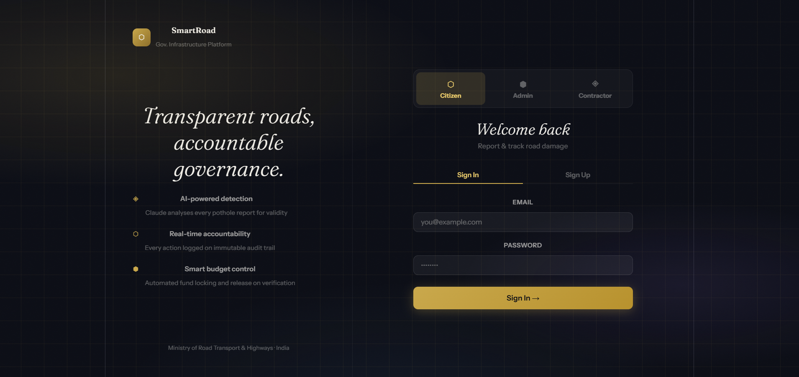
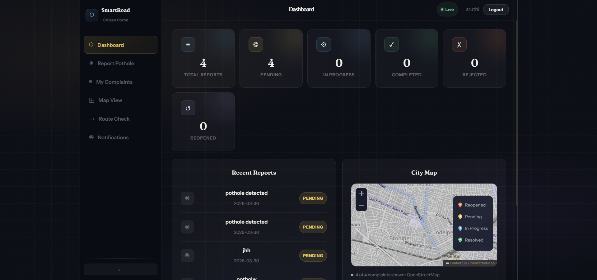
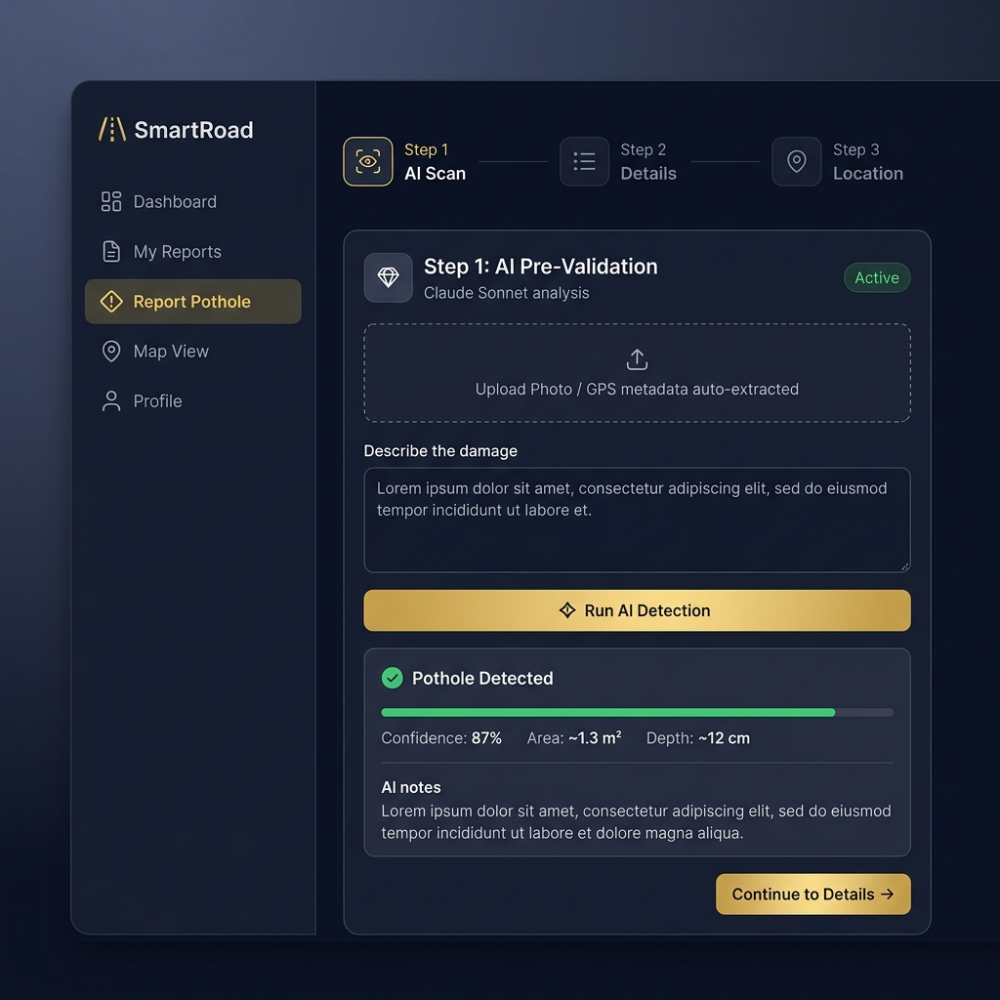
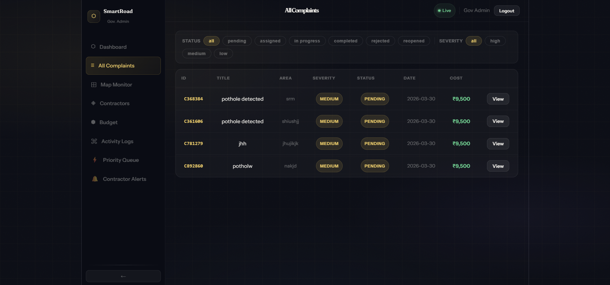
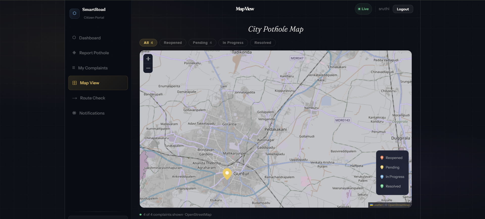
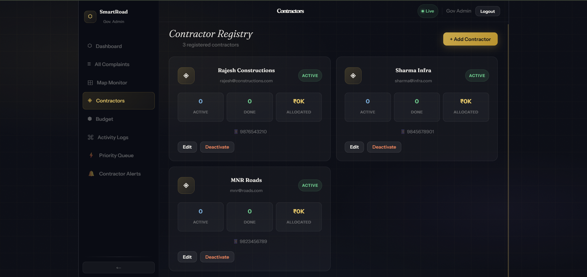
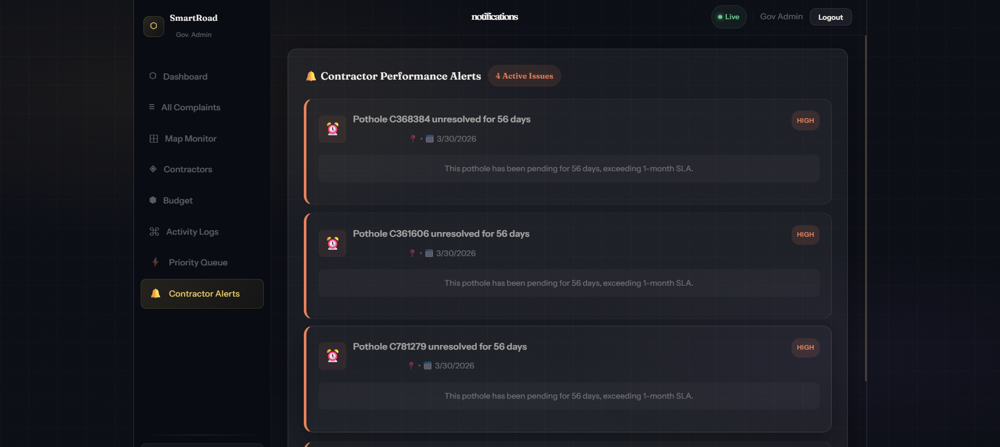
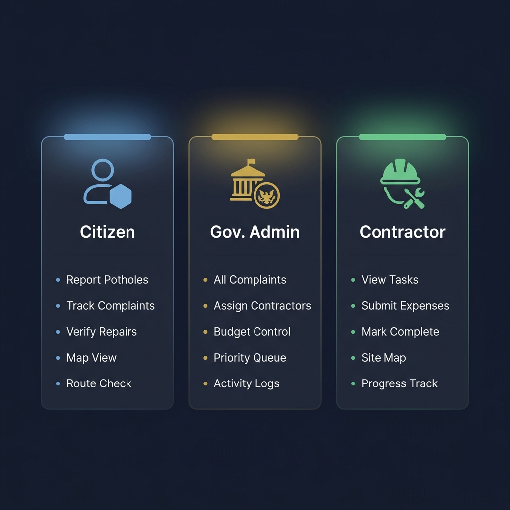
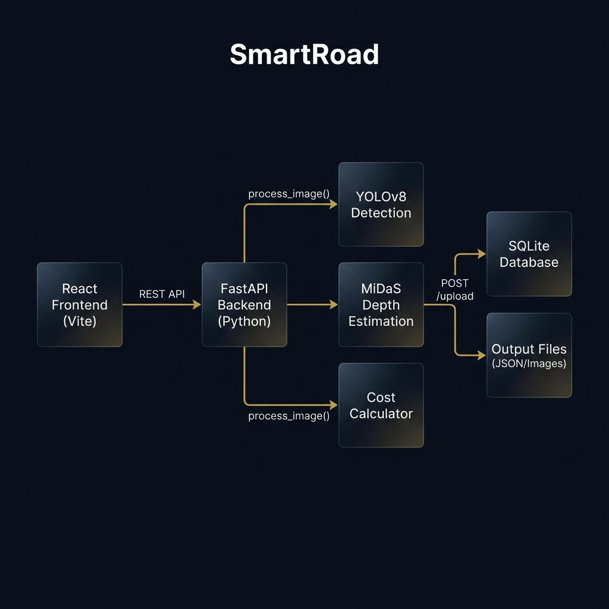

<a id="smartroad---ai-powered-pothole-detection--road-management-platform"></a>

<p align="center">
  
</p>

<h1 align="center">SmartRoad ⬡</h1>
<p align="center">
AI-Powered Pothole Detection & Transparent Road Management for Indian Infrastructure
</p>

<p align="center">
  
  
  
  
  
  
  
</p>

## Table of Contents
- [💡 About the Project](#about-the-project)
- [⚡ Quick Start](#quick-start)
- [🎥 Demo & Screenshots](#demo--screenshots)
- [✨ Features](#features)
- [👥 User Roles](#user-roles)
- [🖥️ Frontend](#frontend)
- [⚙️ Backend](#backend)
- [🚀 Getting Started](#getting-started)
- [🧠 System Architecture](#system-architecture)
- [📊 API Reference](#api-reference)
- [🗃️ Database Schema](#database-schema)
- [📦 Deployment](#deployment)
- [🛠️ Run with Docker](#run-with-docker)
- [🔒 Security & Privacy](#security--privacy)
- [🚀 Future Enhancements](#future-enhancements)
- [🤝 Contributing](#contributing)
- [🙏 Acknowledgements](#acknowledgements)
- [📜 License](#license)

---

## ⚡ Quick Start

### Backend
```bash
git clone <repository-url>
cd SmartRoad/"pothole 1"
python -m venv .venv
.venv\Scripts\activate
pip install -r requirements/base.txt
uvicorn api.app:app --host 0.0.0.0 --port 8000
```

### Frontend
```bash
cd frontend
npm install
npm run dev
```

Open `http://localhost:5173` to view the app 🚀

<p align="right">(<a href="#smartroad---ai-powered-pothole-detection--road-management-platform">⬆ Back to top</a>)</p>

---

## 🎥 Demo & Screenshots

### 🔐 Authentication — Role-Based Login Portal
<p align="center">
  
</p>
<p align="center"><i>Split-screen login — tagline & feature highlights on the left, tri-role selector (Citizen / Admin / Contractor) with sign-in form on the right</i></p>

---

### ⬡ Citizen Dashboard — Personal Reports Overview
<p align="center">
  
</p>
<p align="center"><i>Live stat cards (Total, Pending, In Progress, Completed, Rejected, Reopened), recent complaints list with status badges, and an embedded City Map</i></p>

---

### ◈ Report Pothole — AI Pre-Validation (Step 1 of 3)
<p align="center">
  
</p>
<p align="center"><i>3-step reporting wizard: AI scans description via Claude Sonnet, returns Confidence 87%, Area ~1.3 m², Depth ~12 cm before routing to complaint details</i></p>

---

### ≡ Admin Portal — All Complaints Management
<p align="center">
  
</p>
<p align="center"><i>Full complaints table with Status & Severity filter chips, complaint IDs, area, cost (₹9,500), and inline View action — logged in as Gov Admin</i></p>

---

### ⊞ City Pothole Map — Live Geo-Tagged View
<p align="center">
  
</p>
<p align="center"><i>Leaflet + OpenStreetMap showing 4 complaints across Guntur district — filterable by All / Reopened / Pending / In Progress / Resolved with color-coded pin markers</i></p>

---

### ◈ Admin Portal — Contractor Registry
<p align="center">
  
</p>
<p align="center"><i>Contractor Registry showing 3 registered firms (Rajesh Constructions, Sharma Infra, MNR Roads) with Active / Done / Allocated stats, Edit, and Deactivate controls</i></p>

---

### 🔔 Admin Portal — Contractor Performance Alerts
<p align="center">
  
</p>
<p align="center"><i>Contractor Alerts panel — flags potholes unresolved beyond 1-month SLA with HIGH severity badges, helping admins escalate delayed repairs</i></p>

<p align="right">(<a href="#smartroad---ai-powered-pothole-detection--road-management-platform">⬆ Back to top</a>)</p>

---

## 💡 About the Project

**SmartRoad** is a full-stack, AI-driven civic infrastructure platform built for the Indian government ecosystem. It bridges the gap between citizens, government administrators, and road contractors through a transparent, accountable, and intelligent workflow.

At its core, SmartRoad uses **YOLOv8 segmentation** to detect potholes from road images, **MiDaS** for relative depth estimation, and an automated **cost calculator** to estimate repair budgets — all exposed through a **FastAPI** REST backend. The React frontend provides role-based portals for citizens to report potholes, admins to manage and assign work, and contractors to track tasks and submit expenses.

Every action is logged on an immutable audit trail, and an integrated **AI Pre-Validation** layer (powered by Claude Sonnet) filters out false complaints before they enter the system.

<p align="right">(<a href="#smartroad---ai-powered-pothole-detection--road-management-platform">⬆ Back to top</a>)</p>

---

## ✨ Features

- **🤖 AI Pothole Detection** — YOLOv8 segmentation model (`best.pt`) identifies potholes with pixel-level masks
- **📏 Depth Estimation** — MiDaS (DPT_Large) calculates relative depth to classify pothole severity
- **💰 Automated Cost Calculation** — Repair cost estimated using area, depth, and configurable material rates (cement, sand, aggregate, labor)
- **🗺️ Interactive Map** — Real-time OpenStreetMap view with color-coded status markers (Leaflet.js)
- **👥 Role-Based Portals** — Separate dashboards for Citizens, Gov. Admins, and Contractors
- **🔍 AI Pre-Validation** — Claude Sonnet analyses complaint descriptions to reduce false reports
- **📋 Immutable Audit Trail** — Every action (filing, assignment, completion, re-complaint) is logged with timestamps
- **📦 Budget Management** — Admin-controlled fund locking and release with configurable material rates
- **🔁 Re-Complaint Workflow** — Citizens can reject unsatisfactory repairs with evidence upload
- **🏗️ Priority Queue** — Automatic high-priority escalation for reopened complaints
- **🗃️ SQLite Persistence** — Stores image runs, detected potholes, and GPS-based global pothole deduplication
- **🐳 Docker Ready** — Containerized backend with pre-cached MiDaS model for fast cold starts
- **☁️ Cloud Deployment** — Render (backend) + Vercel (frontend) with `render.yaml` config included

<p align="right">(<a href="#smartroad---ai-powered-pothole-detection--road-management-platform">⬆ Back to top</a>)</p>

---

## 👥 User Roles

<p align="center">
  
</p>

| Feature | 👤 Citizen | 🏛️ Gov. Admin | 👷 Contractor |
|---|---|---|---|
| Report Pothole (AI-validated) | ✅ | ❌ | ❌ |
| Track Own Complaints | ✅ | ❌ | ❌ |
| Verify Repair Quality | ✅ | ❌ | ❌ |
| Raise Re-Complaint | ✅ | ❌ | ❌ |
| View All Complaints | ❌ | ✅ | ❌ |
| Assign Contractors | ❌ | ✅ | ❌ |
| Budget Control | ❌ | ✅ | ❌ |
| Activity Audit Logs | ❌ | ✅ | ❌ |
| Priority Queue Management | ❌ | ✅ | ❌ |
| View Assigned Tasks | ❌ | ❌ | ✅ |
| Submit Expenses | ❌ | ❌ | ✅ |
| Mark Work Complete | ❌ | ❌ | ✅ |
| Map View | ✅ | ✅ | ✅ |

**Demo Credentials:**
- **Admin:** `admin@smartroad.gov.in` / `admin123`
- **Contractor:** `rajesh@constructions.com` / `rajesh123`
- **Citizen:** Sign up with any email

<p align="right">(<a href="#smartroad---ai-powered-pothole-detection--road-management-platform">⬆ Back to top</a>)</p>

---

## 🖥️ Frontend

- **Framework:** React 19 + Vite 8
- **Routing:** Single-page, role-based navigation
- **Styling:** Inline CSS design system with CSS custom properties (no external CSS framework)
- **Map:** Leaflet.js + React-Leaflet (OpenStreetMap tiles with dark filter)
- **Animations:** Framer Motion — fade, slide, float, scan-line, shimmer keyframes
- **Icons:** Lucide React
- **HTTP Client:** Axios
- **Libraries:**
  - `react-leaflet` — Interactive map with marker clustering
  - `framer-motion` — Page transitions and micro-animations
  - `lucide-react` — Icon system

### Design System
The app uses a carefully crafted dark editorial theme:
- **Typefaces:** `Fraunces` (serif headings) + `Instrument Sans` (body)
- **Palette:** `--ink` (#0a0c14), `--gold` (#c9a84c), `--sage` (#4a7c59), `--slate` (#3d5a7a), `--violet` (#5c4a8a)
- **Surfaces:** Glassmorphism cards with `backdrop-filter: blur(12px)`
- **Grid Background:** Gold-tinted 44px grid with radial glow overlays
- **Noise Texture:** SVG fractal noise overlay for premium tactile feel

<p align="right">(<a href="#smartroad---ai-powered-pothole-detection--road-management-platform">⬆ Back to top</a>)</p>

---

## ⚙️ Backend

- **Language:** Python 3.11+
- **Framework:** FastAPI + Uvicorn
- **AI / Computer Vision:**
  - `YOLOv8` (Ultralytics) — Pothole segmentation model (`best.pt`)
  - `MiDaS DPT_Large` (via `torch.hub`) — Monocular depth estimation
  - `OpenCV` — Image processing and visualization rendering
- **Database:** SQLite (persisted to Render Disk in production)
- **Key Dependencies:**
  - `ultralytics` — YOLO inference
  - `torch` / `torchvision` — PyTorch for MiDaS
  - `opencv-python-headless` — Image processing
  - `numpy` — Numerical operations
  - `fastapi`, `uvicorn` — API server

### Service Architecture

| Module | Responsibility |
|--------|---------------|
| `api/app.py` | FastAPI routes: `/upload`, `/records`, `/health`, `/admin/rates` |
| `services/pipeline.py` | Orchestrates full detection pipeline: detect → postprocess → depth → cost → DB |
| `services/detection.py` | YOLOv8 inference + green overlay rendering |
| `services/depth.py` | MiDaS depth map generation + per-mask depth difference |
| `services/postprocess.py` | False-positive filtering + mask merge (IOU-based) |
| `services/cost.py` | Repair cost calculation from area (m²), depth, and material rates |
| `database/db.py` | SQLite schema, insert helpers, global pothole deduplication |
| `config.py` | Thresholds: `CONF_THRESHOLD=0.10`, `IOU_THRESHOLD=0.50`, `METERS_PER_PIXEL=0.005` |

<p align="right">(<a href="#smartroad---ai-powered-pothole-detection--road-management-platform">⬆ Back to top</a>)</p>

---

## 🚀 Getting Started

### Prerequisites
- Python 3.11 or higher
- Node.js 18+ and npm
- Git
- A trained YOLOv8 segmentation model: `best.pt`
- 4GB+ RAM (8GB recommended for MiDaS inference)
- Internet access for first run (MiDaS model download via `torch.hub`)

### Backend Setup

1. **Clone the repository:**
   ```bash
   git clone <repository-url>
   cd SmartRoad
   ```

2. **Set up Python environment** (from `pothole 1/` directory):
   ```powershell
   cd "pothole 1"
   python -m venv .venv
   .venv\Scripts\Activate.ps1
   pip install -r requirements/base.txt
   ```

3. **Place your model file:**
   ```
   pothole 1/best.pt          ← recommended location
   pothole 1/models/best.pt   ← alternative location
   ```
   > The pipeline auto-searches both paths.

4. **Run the API server:**
   ```powershell
   .venv\Scripts\python -m uvicorn api.app:app --host 0.0.0.0 --port 8000
   ```

5. **Open Swagger UI:**
   ```
   http://127.0.0.1:8000/docs
   ```

### Frontend Setup

1. **Install dependencies** (from `frontend/` directory):
   ```bash
   cd frontend
   npm install
   ```

2. **Configure API endpoint:**
   Create `frontend/.env`:
   ```env
   VITE_API_BASE_URL=http://localhost:8000
   ```

3. **Start development server:**
   ```bash
   npm run dev
   ```

4. Open `http://localhost:5173`

<p align="right">(<a href="#smartroad---ai-powered-pothole-detection--road-management-platform">⬆ Back to top</a>)</p>

---

## 🧠 System Architecture

<p align="center">
  
</p>

### Pipeline Workflow

```
User uploads image via React Frontend
         ↓
POST /upload → FastAPI backend
         ↓
 services/pipeline.py (process_image)
    ├── YOLOv8 detect()         → pixel masks + confidence scores
    ├── postprocess()           → filter false positives, merge overlapping masks
    ├── MiDaS depth map         → per-mask depth difference (capped 3–15 cm)
    ├── calculate_cost()        → ₹ repair estimate (cement + sand + aggregate + labor)
    └── SQLite insert           → image_runs + potholes tables
         ↓
Returns: { potholes[], annotated_image (base64 JPEG) }
         ↓
Frontend renders overlay image + JSON results
```

### Global Pothole Deduplication
When GPS coordinates are provided, the pipeline uses **Hu Moment shape signatures** to match new detections against existing `global_potholes` records — preventing the same physical pothole from being counted multiple times across different uploads.

<p align="right">(<a href="#smartroad---ai-powered-pothole-detection--road-management-platform">⬆ Back to top</a>)</p>

---

## 📊 API Reference

### `POST /upload`
Upload a road image for pothole detection.

**Request:** `multipart/form-data` with `file` field

**Response:**
```json
{
  "potholes": [
    {
      "image_id": "IMG_a1b2c3d4e5f6",
      "id": 1,
      "pothole_global_id": null,
      "area_pixels": 5234,
      "area_m2": 0.1309,
      "depth": 0.08,
      "confidence": 0.87,
      "estimated_cost": 9500,
      "breakdown": {
        "cement": 2660,
        "sand": 1330,
        "aggregate": 2470,
        "labor": 3040
      }
    }
  ],
  "annotated_image": "data:image/jpeg;base64,..."
}
```

### `GET /records`
Returns all stored pothole records from SQLite.

### `DELETE /records`
Clears all pothole rows (keeps `image_runs` intact).

### `GET /health`
Health check for deployment monitoring. Returns `{"status": "healthy"}`.

### `GET /admin/rates`
Get current material cost rates.

### `POST /admin/update-rates`
Update material rates (cement, sand, aggregate, labor per unit).

**Body:**
```json
{
  "cement_per_bag": 450,
  "sand_per_m3": 180,
  "aggregate_per_m3": 320,
  "labor_per_m3": 850
}
```

<p align="right">(<a href="#smartroad---ai-powered-pothole-detection--road-management-platform">⬆ Back to top</a>)</p>

---

## 🗃️ Database Schema

SQLite file: `database/potholes.db`

| Table | Key Columns | Purpose |
|-------|------------|---------|
| `image_runs` | `image_id`, `filename`, `input_image` (BLOB), `output_image` (BLOB), `output_json`, `lat`, `lon` | One row per uploaded image |
| `potholes` | `image_id` (FK), `pothole_id`, `area`, `confidence`, `depth`, `lat`, `lon` | One row per detected pothole |
| `global_potholes` | `id`, `lat`, `lon`, `area_m2`, `depth`, `hu_signature` | GPS-deduplicated pothole registry |

<p align="right">(<a href="#smartroad---ai-powered-pothole-detection--road-management-platform">⬆ Back to top</a>)</p>

---

## 📦 Deployment

SmartRoad uses a split-deploy architecture:

| Layer | Platform | Technology |
|-------|----------|-----------|
| Frontend | **Vercel** | Vite + React (SPA) |
| Backend | **Render** | Docker + FastAPI |
| Database | **Render Disk** | SQLite (1GB persistent disk) |

### Backend → Render

1. Push to GitHub with `best.pt` committed
2. Create Web Service → Docker runtime
3. Root Directory: `pothole 1`
4. Add Disk: Mount Path `/data`, Size 1GB
5. Environment Variables:
   ```
   DB_PATH=/data/potholes.db
   PORT=8000
   ```

> `render.yaml` is pre-configured in the repo root for one-click Render Blueprint deployment.

### Frontend → Vercel

```bash
cd frontend
vercel --prod
```

Set environment variable in Vercel Dashboard:
```
VITE_API_BASE_URL=https://your-backend.onrender.com
```

### Post-Deployment Checklist
- [ ] `GET /health` returns `{"status": "healthy"}`
- [ ] CORS working — frontend can reach backend
- [ ] Upload test image → annotated result returned
- [ ] SQLite records persist after redeploy
- [ ] Material rates configurable via `/admin/update-rates`

<p align="right">(<a href="#smartroad---ai-powered-pothole-detection--road-management-platform">⬆ Back to top</a>)</p>

---

## 🛠️ Run with Docker

### Local Docker (single command)
```bash
# From repo root
docker compose up --build

# Test
curl http://localhost:8000/health
```

### Build manually
```bash
cd "pothole 1"
docker build -t smartroad-backend .
docker run -p 8000:8000 -e PORT=8000 smartroad-backend
```

> The Dockerfile pre-downloads and caches the MiDaS DPT_Large model **during build** to avoid cold-start timeouts on Render.

<p align="right">(<a href="#smartroad---ai-powered-pothole-detection--road-management-platform">⬆ Back to top</a>)</p>

---

## 📊 Testing & Evaluation

### Evaluate detection quality against dataset labels
```powershell
.venv\Scripts\python run_local_test.py --dataset "PUBLIC POTHOLE DATASET" --limit 10
# Verbose:
.venv\Scripts\python run_local_test.py --dataset "PUBLIC POTHOLE DATASET" --limit 10 --debug
```

### Verify depth values against dataset depth maps
```powershell
.venv\Scripts\python verify_dataset_values.py --dataset "PUBLIC POTHOLE DATASET" --limit 10
# With MiDaS comparison:
.venv\Scripts\python verify_dataset_values.py --dataset "PUBLIC POTHOLE DATASET" --limit 10 --debug --include-midas
```

### Batch run entire dataset
```powershell
.venv\Scripts\python batch_run_dataset.py
```

<p align="right">(<a href="#smartroad---ai-powered-pothole-detection--road-management-platform">⬆ Back to top</a>)</p>

---

## 🔒 Security & Privacy

- All images are processed server-side; raw pixels are not returned to the client (only base64 annotated output)
- No cloud AI calls are made for detection — fully local YOLOv8 + MiDaS inference
- Admin and contractor credentials are validated against hardcoded records (suitable for demo; replace with hashed DB auth for production)
- CORS is open (`allow_origins=["*"]`) — restrict to your Vercel domain in production
- SQLite database is stored on a private Render Disk volume

<p align="right">(<a href="#smartroad---ai-powered-pothole-detection--road-management-platform">⬆ Back to top</a>)</p>

---

## 🛠️ Troubleshooting

| Issue | Solution |
|-------|----------|
| `best.pt not found` | Ensure `best.pt` is committed to git and not in `.gitignore` |
| MiDaS download fails on first run | Ensure internet access; run one local inference to cache `~/.cache/torch/hub` |
| `500` error on upload | Check Render logs — usually MiDaS or YOLO weight issues |
| CORS errors | Set `VITE_API_BASE_URL` correctly in Vercel environment variables |
| SQLite data lost on redeploy | Confirm `DB_PATH=/data/potholes.db` and disk is mounted at `/data` |
| Ultralytics console spam | Use `--debug` flag in test scripts to control verbosity |

<p align="right">(<a href="#smartroad---ai-powered-pothole-detection--road-management-platform">⬆ Back to top</a>)</p>

---

## 🚀 Future Enhancements

- 📱 **Mobile App** — React Native citizen portal with built-in camera geo-tagging
- 🛰️ **GPS Auto-Extract** — EXIF-based GPS extraction from uploaded photos
- 📊 **Analytics Dashboard** — Historical repair trends, ward-level heatmaps
- 🔐 **Auth Hardening** — JWT + bcrypt hashed passwords, role-scoped tokens
- 🌐 **Multi-Language** — Telugu, Hindi, Tamil UI support
- 🤖 **LLM Integration** — Natural language complaint summarisation and severity prediction
- 📡 **Real-Time Notifications** — WebSocket-based status push notifications
- 🧪 **Automated Testing** — Pytest suite for pipeline + API endpoints

<p align="right">(<a href="#smartroad---ai-powered-pothole-detection--road-management-platform">⬆ Back to top</a>)</p>

---

## 🤝 Contributing

Contributions are welcome! Please follow these steps:

1. Fork the repository
2. Create your feature branch (`git checkout -b feature/AmazingFeature`)
3. Commit your changes (`git commit -m 'Add some AmazingFeature'`)
4. Push to the branch (`git push origin feature/AmazingFeature`)
5. Open a Pull Request

<p align="right">(<a href="#smartroad---ai-powered-pothole-detection--road-management-platform">⬆ Back to top</a>)</p>

---

## 🙏 Acknowledgements

- [Ultralytics YOLOv8](https://github.com/ultralytics/ultralytics) — State-of-the-art object detection and segmentation
- [Intel MiDaS](https://github.com/isl-org/MiDaS) — Monocular depth estimation
- [FastAPI](https://fastapi.tiangolo.com/) — High-performance Python API framework
- [React Leaflet](https://react-leaflet.js.org/) — Interactive maps with OpenStreetMap
- [Framer Motion](https://www.framer.com/motion/) — Production-ready animation library
- [OpenStreetMap](https://www.openstreetmap.org/) — Open-source map tiles
- [Render](https://render.com/) — Cloud deployment platform
- [Vercel](https://vercel.com/) — Frontend deployment

---

## 📜 License

Distributed under the MIT License. See `LICENSE` for more information.

---

*This project is maintained by Gudiwada Sruthi. For support, please open an issue in the repository.*
